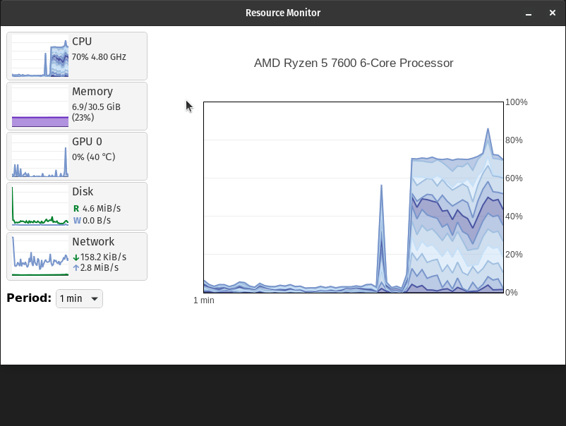

# Resource monitor

A resource monitor with a Windows Task Manager-inspired look.

Created using [Tauri](https://tauri.app/) and [Leptos](https://leptos.dev/).



## How to install

Head to the ***[releases](https://github.com/stlenyk/resource-monitor/releases)*** tab and download a package suitable for you.

## Build from source

[Detailed instructions](https://tauri.app/v1/guides/getting-started/prerequisites)

1. Install [Rust](https://www.rust-lang.org/learn/get-started).

2. Install WASM and its bundler [Trunk](https://trunkrs.dev/):

    ```sh
    rustup target add wasm32-unknown-unknown
    cargo install trunk
    ```

3. Install Tauri's Rust CLI:

    * dependencies (for Windows/Mac/non-Debian Linux see [detailed instructions](https://v2.tauri.app/start/prerequisites/)):

        ```sh
        sudo apt install \
        libwebkit2gtk-4.1-dev \
        build-essential \
        curl \
        wget \
        file \
        libxdo-dev \
        libssl-dev \
        libayatana-appindicator3-dev \
        librsvg2-dev
        ```

    * CLI itself:

        ```sh
        cargo install tauri-cli
        ```

4. `cd` into the project directory and:

    * For hot reload dev build run

        ```sh
        cargo tauri dev
        ```

    * For release build run

        ```sh
        cargo tauri build
        ```

        The app binary will be located in `target/release`.

## Docker

1. build

    ```sh
    docker build -t resource-monitor .
    ```

2. run

    ```sh
    docker run \
        --rm \
        -it \
        -v $PWD:$PWD \
        -w $PWD \
        --gpus all \
        -e DISPLAY=unix$DISPLAY \
        -v $XAUTHORITY:/root/.Xauthority \
        -v /tmp/.X11-unix:/tmp/.X11-unix \
        resource-monitor
    ```

    * Passing GPUs to docker container (via `--gpus all`) requires `nvidia-container-toolkit`. For Ubuntu run:

        ```sh
        sudo apt install nvidia-container-toolkit
        sudo systemctl restart docker
        ```

    * The last three options:

        ```sh
        -e DISPLAY=unix$DISPLAY \
        -v $XAUTHORITY:/root/.Xauthority \
        -v /tmp/.X11-unix:/tmp/.X11-unix \
        ```

        are only needed for display support.

All files created by the docker container be will be owned by root. To remedy that run:

```sh
sudo chown -R $(id -u):$(id -g) .
```

which will transfer ownership of all files in current directory to the current user and group.
